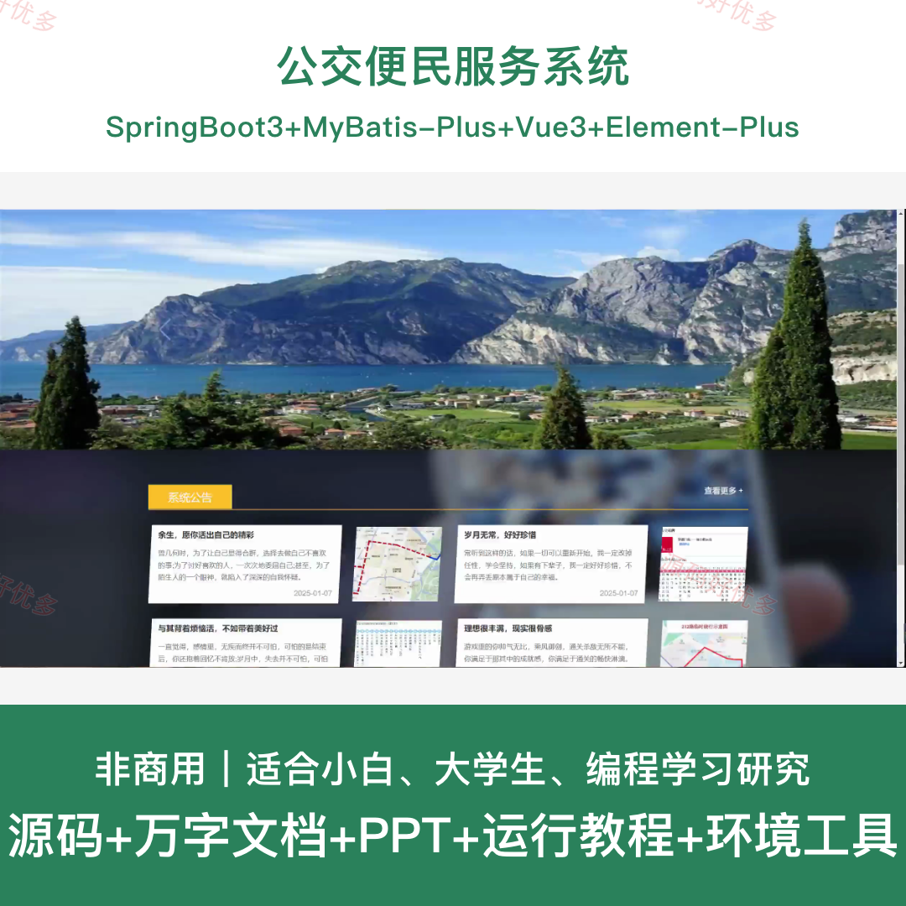
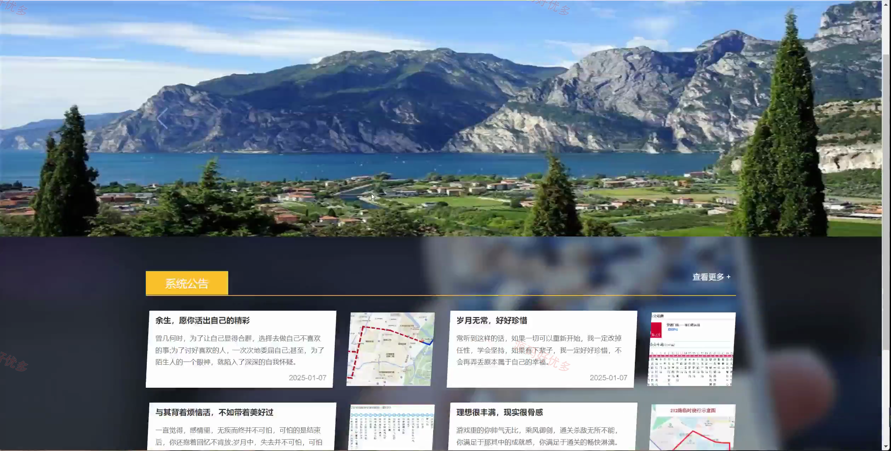
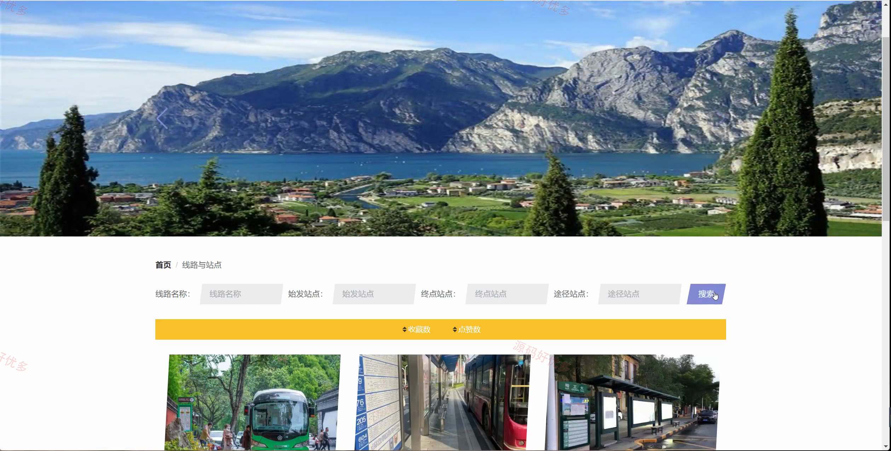
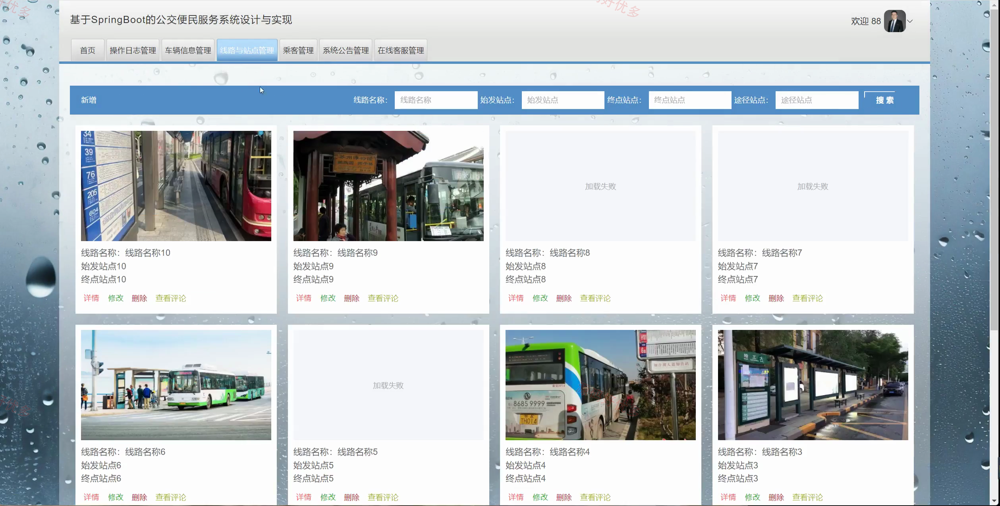
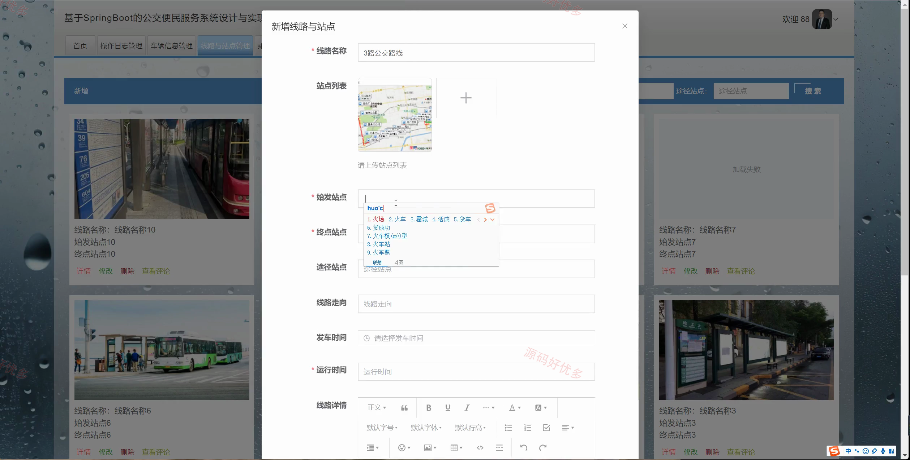
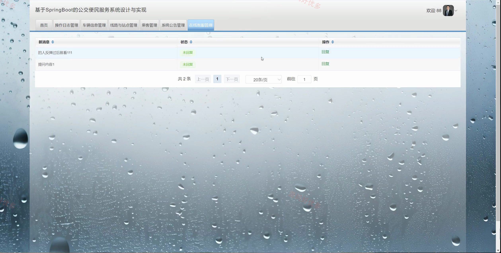
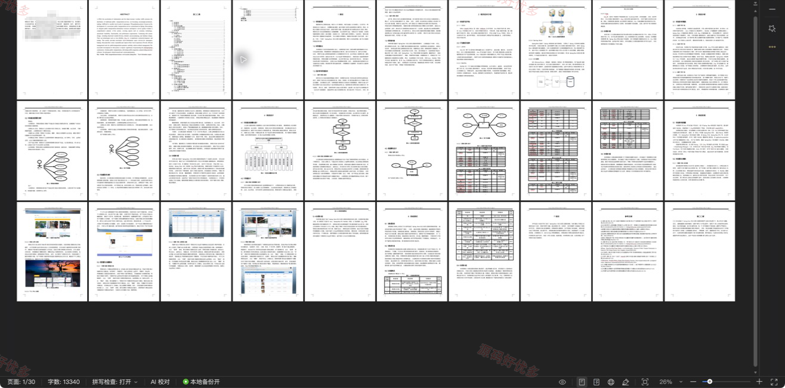

## 源码问题查看主页咨询

### 一、关键词
公交便民服务系统、公交便民服务、公交便民服务预约、公交便民服务管理

### 二、作品包含
源码+数据库+万字设计文档+PPT+全套环境和工具资源+本地部署教程

### 三、项目技术
前端技术： Html、Css、Js、Vue3.2、Element-Plus
后端技术：Java、SpringBoot3.3.0、MyBatis-Plus

### 四、运行环境（以下版本亲测，其他版本兼容性请自行测试）
开发工具：IDEA/eclipse + VSCODE

数据库：MySQL8.0+（共14张表）

数据库管理工具：Navicat10以上版本

环境配置软件： JDK17 + Maven3.6.3

前端Nodejs：16+

浏览器：谷歌浏览器

### 五、项目介绍
项目编号：springbootA596D

公交便民服务系统面向管理员、乘客、普通管理员，提供普通管理员管理、车辆信息管理、轮播图管理、线路与站点管理、操作日志管理、在线客服管理、乘客管理等功能，实现各角色在系统中的实际业务协作。

角色：管理员、乘客、普通管理员

管理员功能：后台登录、普通管理员管理、车辆与线路站点管理、轮播图管理、操作日志管理、在线客服管理、乘客管理、系统公告管理。

乘客功能：前台登录、前台注册、系统公告查看、线路与站点浏览与互动、线路与站点查看评论。

普通管理员功能：后台登录、后台注册、操作日志管理、车辆信息管理、线路与站点管理、乘客管理、系统公告管理、在线客服管理。

### 六、运行截图

